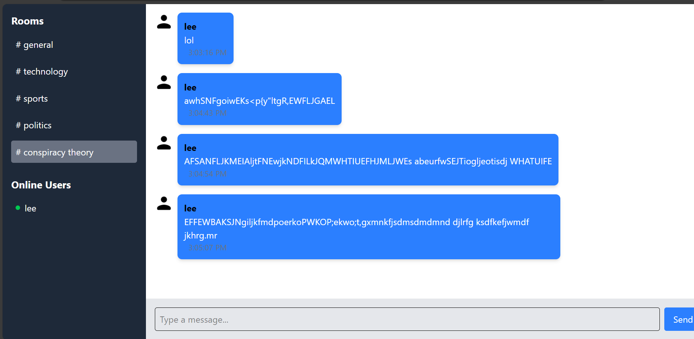

# Real-Time Private Chat App

---

## Live Demo

[](https://week5-socket-io-group16.onrender.com/)

### [](https://week5-socket-io-group16.onrender.com/)

## Introduction

This real-time private chat application allows users to create or join private chat rooms instantly without the need for accounts or sign-ups. It emphasizes simplicity, user privacy, and seamless real-time communication.

## Features

- **Anonymous Chat**: Users can enter chatrooms with just a username, maintaining anonymity.
- **Private Rooms**: Create unique chatrooms with randomly generated room IDs. Share the ID with friends to join the conversation.
- **Real-Time Messaging**: Powered by Socket.IO for instant communication. Messages are broadcast to all users in the room with zero delay.
- **Chat History Persistence**: Chat history is saved in the database, ensuring no messages are lost if a user refreshes the page.
- **User-Friendly Interface**: Clean and responsive design using Tailwind CSS for a modern look.

## Tech Stack

- **Frontend**: React.js.
- **Backend**: Node.js, Express.js, Socket.IO.
- **Database**: MongoDB.
- **Utilities**: `uuid` for generating unique room IDs.

## How It Works

1. **Home Page**:

   - Click **Create Room** to generate a new private chatroom and navigate to it.
   - Click **Join Room** to enter an existing chatroom using the room ID.

2. **Chatroom**:

   - Start chatting in real-time! See all messages, the room ID, and the usernames of participants.

3. **Events**:
   - `join-room`: Notify other users when someone joins.
   - `send-message`: Broadcast messages to all users in the room.
   - `leave-room`: Notify users when someone leaves.

## Installation

### Step-by-Step Guide

1. **Clone the Repository**:

```bash
    git clone https://github.com/SaddamTechie/week5-socket-io-Group16.git real-time-private-cat
    cd real-time-private-chat
```

2. **Install Dependencies**:

```bash
    npm run build
```

3. **Set MongoDB_URI**:
   Create `.env` file in the root folder and add:

```
    MONGO_URI=<YOUR_MONGO_URI>
    PORT=5000
```

4. **Start the Application**:
   Set NODE_ENV to production:

```powershell
    $env:NODE_ENV="production"
```

Start app:

```bash
    npm run start
```

5. **Access the App**:
   Open a web browser and navigate to `http://localhost:5000`.
